# 03. Reranking

**Two-stage retrieval with semantic reranking**

Improve search quality by reranking initial results using a cross-encoder or LLM-based reranker.

## Architecture Overview

```mermaid
%%{init: {'theme': 'base', 'themeVariables': { 'primaryColor': '#1565c0'}}}%%
flowchart TB
    subgraph Query["📝 User Query"]
        Q["Best cordless drill for DIY projects"]
    end

    subgraph Stage1["🔍 Stage 1: Initial Retrieval"]
        VS["Vector Search<br/>━━━━━━━━━━━━━━━━<br/>Fast embedding lookup<br/>Top 100 candidates"]
        Results1["📋 100 Results<br/><i>Broad recall</i>"]
    end

    subgraph Stage2["🎯 Stage 2: Reranking"]
        Reranker["Cross-Encoder Reranker<br/>━━━━━━━━━━━━━━━━<br/>Score each (query, doc) pair<br/>Semantic similarity"]
        Results2["📋 Top 10 Results<br/><i>Precise ranking</i>"]
    end

    subgraph Response["📤 Final Response"]
        Best["🥇 Best matches"]
    end

    Q --> VS
    VS --> Results1
    Results1 --> Reranker
    Reranker --> Results2
    Results2 --> Best

    style Stage1 fill:#e3f2fd,stroke:#1565c0
    style Stage2 fill:#e8f5e9,stroke:#2e7d32
```



## Examples

| File | Description |
|------|-------------|
| [`reranking_basic.yaml`](./reranking_basic.yaml) | Two-stage retrieval with cross-encoder reranking |

## Why Reranking?


## Two-Stage Process


## Configuration

```yaml
resources:
  vector_stores:
    products_store: &products_store
      catalog_name: retail_consumer_goods
      schema_name: hardware_store
      index_name: products_vs_index
      columns:
        - product_name
        - description
        - category

  rerankers:
    product_reranker: &product_reranker
      type: cross_encoder           # or 'llm' for LLM-based
      model: databricks-gte-large-en
      top_k: 10                      # Final results count

tools:
  search_tool: &search_tool
    name: search_products
    function:
      type: factory
      name: dao_ai.tools.create_vector_search_tool
      args:
        vector_store: *products_store
        reranker: *product_reranker   # ← Add reranking
        num_results: 100              # ← Initial retrieval count
```

## Reranker Types

```mermaid
%%{init: {'theme': 'base'}}%%
graph TB
    subgraph Types["🎯 Reranker Types"]
        subgraph CrossEncoder["🔀 Cross-Encoder"]
            CE1["<b>type: cross_encoder</b>"]
            CE2["• Fast (batch processing)"]
            CE3["• Purpose-built for ranking"]
            CE4["• Lower cost"]
        end
        
        subgraph LLM["🧠 LLM-Based"]
            LLM1["<b>type: llm</b>"]
            LLM2["• More nuanced"]
            LLM3["• Can follow instructions"]
            LLM4["• Higher cost"]
        end
    end

    style CrossEncoder fill:#e3f2fd,stroke:#1565c0
    style LLM fill:#e8f5e9,stroke:#2e7d32
```



### Cross-Encoder Configuration

```yaml
rerankers:
  cross_encoder_reranker: &cross_encoder_reranker
    type: cross_encoder
    model: databricks-gte-large-en
    top_k: 10
```

### LLM-Based Configuration

```yaml
rerankers:
  llm_reranker: &llm_reranker
    type: llm
    model: *default_llm
    top_k: 10
    prompt: |
      Rate the relevance of this document to the query.
      Query: {query}
      Document: {document}
      Score (0-10):
```

## Performance Trade-offs

```mermaid
%%{init: {'theme': 'base'}}%%
graph LR
    subgraph Tradeoffs["⚖️ Performance Trade-offs"]
        subgraph Fast["⚡ Faster"]
            F1["Smaller num_results"]
            F2["Lower top_k"]
            F3["Cross-encoder model"]
        end
        
        subgraph Quality["🎯 Higher Quality"]
            Q1["Larger num_results"]
            Q2["Higher top_k"]
            Q3["LLM reranker"]
        end
    end

    style Fast fill:#e3f2fd,stroke:#1565c0
    style Quality fill:#e8f5e9,stroke:#2e7d32
```



| Setting | Trade-off |
|---------|-----------|
| `num_results: 50` | Faster, might miss relevant docs |
| `num_results: 200` | Slower, better recall |
| `top_k: 5` | Focused results |
| `top_k: 20` | More comprehensive |

## Quick Start

```bash
# Run with reranking
dao-ai chat -c config/examples/03_reranking/reranking_basic.yaml

# Compare results
> Search for cordless drills
# Notice: Results are more relevant to intent
```

## Best Practices

```mermaid
%%{init: {'theme': 'base'}}%%
graph TB
    subgraph Best["✅ Best Practices"]
        BP1["📊 Set num_results 5-10x larger than top_k"]
        BP2["⚡ Use cross-encoder for speed"]
        BP3["🧠 Use LLM for complex queries"]
        BP4["📈 Monitor latency vs quality"]
    end

    style Best fill:#e8f5e9,stroke:#2e7d32
```



## Troubleshooting

| Issue | Solution |
|-------|----------|
| Slow reranking | Reduce num_results, use cross-encoder |
| Poor results | Increase num_results, try LLM reranker |
| Missing relevant docs | Increase num_results in initial retrieval |

## Next Steps

- **04_genie/** - Add caching for repeated queries
- **02_mcp/** - Use MCP for vector search
- **10_agent_integrations/** - Combine with other tools

## Related Documentation

- [Reranking Configuration](../../../docs/key-capabilities.md#reranking)
- [Vector Search](../../../docs/configuration-reference.md#vector-stores)
