# 15. Complete Applications

**Production-ready examples combining multiple features**

End-to-end configurations demonstrating best practices for real-world deployments.

## Architecture Overview

```mermaid
%%{init: {'theme': 'base', 'themeVariables': { 'primaryColor': '#1565c0'}}}%%
flowchart TB
    subgraph Complete["🏗️ Complete Application Architecture"]
        subgraph UI["🖥️ User Interface"]
            Chat["💬 Chat UI"]
            API["🔌 REST API"]
        end
        
        subgraph Core["🤖 DAO AI Core"]
            subgraph Orchestration["🎭 Orchestration"]
                Supervisor["👔 Supervisor"]
                Swarm["🐝 Swarm"]
            end
            
            subgraph Agents["👷 Specialized Agents"]
                A1["🛒 Product"]
                A2["📦 Inventory"]
                A3["💬 General"]
            end
            
            subgraph Features["✨ Features"]
                F1["🧠 Memory"]
                F2["🔒 PII Protection"]
                F3["🛡️ Guardrails"]
                F4["⏸️ HITL"]
            end
        end
        
        subgraph Data["☁️ Databricks Platform"]
            LLM["🧠 LLM Endpoints"]
            VS["🔍 Vector Search"]
            Genie["🧞 Genie Rooms"]
            MCP["🔌 MCP Servers"]
            SQL["🗄️ SQL Warehouse"]
        end
    end

    UI --> Core
    Core --> Data

    style UI fill:#e3f2fd,stroke:#1565c0
    style Orchestration fill:#fff3e0,stroke:#e65100
    style Agents fill:#e8f5e9,stroke:#2e7d32
    style Features fill:#fce4ec,stroke:#c2185b
    style Data fill:#f3e5f5,stroke:#7b1fa2
```



## Examples

| File | Pattern | Description | Complexity |
|------|---------|-------------|------------|
| [`hardware_store_supervisor.yaml`](./hardware_store_supervisor.yaml) | 👔 Supervisor | Multi-agent supervisor with full features | ⭐⭐⭐⭐ |
| [`hardware_store_swarm.yaml`](./hardware_store_swarm.yaml) | 🐝 Swarm | Swarm orchestration with handoffs | ⭐⭐⭐⭐ |
| [`executive_assistant.yaml`](./executive_assistant.yaml) | 🤖 Single Agent | Comprehensive assistant (email, calendar, Slack) | ⭐⭐⭐⭐⭐ |
| [`deep_research.yaml`](./deep_research.yaml) | 🔬 Research | Multi-step research agent with web search | ⭐⭐⭐⭐ |
| [`genie_vector_search_hybrid.yaml`](./genie_vector_search_hybrid.yaml) | 🔀 Hybrid | Combined SQL and vector search | ⭐⭐⭐⭐ |
| [`hardware_store_instructed.yaml`](./hardware_store_instructed.yaml) | 🎯 Instructed | Hardware store with instructed retrieval | ⭐⭐⭐⭐ |

## Hardware Store Supervisor Architecture

```mermaid
%%{init: {'theme': 'base'}}%%
flowchart TB
    subgraph User["👤 Customer"]
        Query["Do you have Dewalt drills?<br/>What's the price and stock?"]
    end

    subgraph Supervisor["🎯 Supervisor Agent"]
        Router["Routing LLM<br/>━━━━━━━━━━━━━━━━<br/>Analyzes request<br/>Routes to specialist"]
    end

    subgraph Specialists["👷 Specialized Agents"]
        subgraph Product["🛒 Product Agent"]
            PT["Tools:<br/>• vector_search<br/>• genie_query<br/>━━━━━━━━━━━━━━━━<br/>Details, specs, pricing"]
        end
        
        subgraph Inventory["📦 Inventory Agent"]
            IT["Tools:<br/>• inventory_search<br/>• stock_check<br/>━━━━━━━━━━━━━━━━<br/>Availability, locations"]
        end
        
        subgraph General["💬 General Agent"]
            GT["Tools:<br/>• policies_search<br/>━━━━━━━━━━━━━━━━<br/>Hours, policies, FAQs"]
        end
    end

    subgraph Features["✨ Applied Features"]
        Memory["🧠 PostgreSQL Memory"]
        PII["🔒 PII Detection"]
        Guard["🛡️ Guardrails"]
    end

    Query --> Router
    Router --> Product
    Router -.-> Inventory
    Router -.-> General
    Product --> Features
    Inventory --> Features
    General --> Features

    style Supervisor fill:#fff3e0,stroke:#e65100
    style Product fill:#e8f5e9,stroke:#2e7d32
    style Features fill:#e3f2fd,stroke:#1565c0
```



## Hardware Store Swarm Architecture

```mermaid
%%{init: {'theme': 'base'}}%%
flowchart TB
    subgraph User["👤 Customer"]
        Query["Compare Dewalt vs Milwaukee drills<br/>Check stock for both"]
    end

    subgraph Swarm["🐝 Agent Swarm"]
        subgraph Product["🛒 Product Agent"]
            PT["Tools:<br/>• search_products<br/>• <b>transfer_to_inventory</b><br/>• <b>transfer_to_comparison</b>"]
        end
        
        subgraph Inventory["📦 Inventory Agent"]
            IT["Tools:<br/>• check_stock<br/>• <b>transfer_to_product</b><br/>• <b>transfer_to_comparison</b>"]
        end
        
        subgraph Comparison["⚖️ Comparison Agent"]
            CT["Tools:<br/>• compare_products<br/>• <b>transfer_to_product</b><br/>• <b>transfer_to_inventory</b>"]
        end
    end

    subgraph Features["✨ Applied Features"]
        Memory["🧠 Memory"]
        Middleware["🔒 Swarm Middleware"]
    end

    Query --> Product
    Product <-->|"handoff"| Inventory
    Product <-->|"handoff"| Comparison
    Inventory <-->|"handoff"| Comparison
    Swarm --> Features

    style Swarm fill:#e8f5e9,stroke:#2e7d32
    style Features fill:#e3f2fd,stroke:#1565c0
```



## Feature Integration

```mermaid
%%{init: {'theme': 'base'}}%%
graph TB
    subgraph Integration["🔗 Feature Integration"]
        subgraph Memory["🧠 Memory"]
            M1["checkpointer: postgres"]
            M2["store: postgres"]
            M3["summarizer: *default_llm"]
        end
        
        subgraph Middleware["🔒 Middleware"]
            MW1["pii_detection: local"]
            MW2["pii_restoration: local"]
            MW3["logger: INFO"]
        end
        
        subgraph Guardrails["🛡️ Guardrails"]
            G1["tone_check"]
            G2["completeness_check"]
            G3["num_retries: 2"]
        end
        
        subgraph Tools["🔧 Tools"]
            T1["Genie MCP"]
            T2["Vector Search"]
            T3["SQL Warehouse"]
        end
    end

    style Memory fill:#e3f2fd,stroke:#1565c0
    style Middleware fill:#e8f5e9,stroke:#2e7d32
    style Guardrails fill:#fff3e0,stroke:#e65100
    style Tools fill:#fce4ec,stroke:#c2185b
```



## Production Checklist

```mermaid
%%{init: {'theme': 'base'}}%%
flowchart TB
    subgraph Checklist["✅ Production Checklist"]
        subgraph Security["🔐 Security"]
            S1["☐ PII middleware enabled"]
            S2["☐ Secrets in Unity Catalog"]
            S3["☐ HITL for sensitive ops"]
        end
        
        subgraph Reliability["🔄 Reliability"]
            R1["☐ PostgreSQL memory"]
            R2["☐ Guardrails configured"]
            R3["☐ Error handling"]
        end
        
        subgraph Observability["📊 Observability"]
            O1["☐ MLflow tracing"]
            O2["☐ Logging middleware"]
            O3["☐ Metrics collection"]
        end
        
        subgraph Scale["📈 Scale"]
            SC1["☐ Load testing"]
            SC2["☐ Rate limiting"]
            SC3["☐ Model registration"]
        end
    end

    style Security fill:#ffebee,stroke:#c62828
    style Reliability fill:#e8f5e9,stroke:#2e7d32
    style Observability fill:#e3f2fd,stroke:#1565c0
    style Scale fill:#fff3e0,stroke:#e65100
```



## Configuration Structure

```yaml
# Complete Application Structure
schemas:
  retail_schema: &retail_schema           # Unity Catalog location

resources:
  llms:
    default_llm: &default_llm             # Primary LLM
    judge_llm: &judge_llm                 # Guardrail evaluator
  vector_stores:
    products_store: &products_store       # Semantic search
  genie_rooms:
    retail_genie: &retail_genie           # Natural language SQL

prompts:
  tone_prompt: &tone_prompt               # Guardrail prompts
  agent_prompts: ...                      # Agent instructions

middleware:
  pii_detection: &pii_detection           # Input protection
  pii_restoration: &pii_restoration       # Output restoration
  logger: &logger                         # Audit logging

guardrails:
  tone_check: &tone_check                 # Response quality
  completeness_check: &completeness_check

tools:
  genie_tool: &genie_tool                 # Data queries
  vector_tool: &vector_tool               # Semantic search
  handoff_tools: ...                      # For swarm pattern

agents:
  product_agent: &product_agent
  inventory_agent: &inventory_agent
  general_agent: &general_agent

app:
  name: hardware_store_assistant
  agents: [*product_agent, *inventory_agent, *general_agent]
  orchestration:
    supervisor:                           # or swarm:
      model: *default_llm
      prompt: "Route to appropriate agent..."
      middleware: [*pii_detection, *pii_restoration]
    memory:
      checkpointer:
        type: postgres
        connection_string: "{{secrets/scope/postgres}}"
```

## Quick Start

```bash
# Validate complete application
dao-ai validate -c config/examples/15_complete_applications/hardware_store_supervisor.yaml

# Run in chat mode
dao-ai chat -c config/examples/15_complete_applications/hardware_store_supervisor.yaml

# Visualize architecture
dao-ai graph -c config/examples/15_complete_applications/hardware_store_supervisor.yaml -o architecture.png

# Register as MLflow model
dao-ai register -c config/examples/15_complete_applications/hardware_store_supervisor.yaml
```

## Deployment Options

```mermaid
%%{init: {'theme': 'base'}}%%
graph LR
    subgraph Deploy["🚀 Deployment Options"]
        subgraph Model["📦 MLflow Model"]
            M["dao-ai register<br/>━━━━━━━━━━━━━━━━<br/>Versioned artifact<br/>Model serving ready"]
        end
        
        subgraph App["🖥️ Databricks App"]
            A["dao-ai-builder<br/>━━━━━━━━━━━━━━━━<br/>Web UI<br/>REST API"]
        end
        
        subgraph Endpoint["⚡ Model Serving"]
            E["Serverless Endpoint<br/>━━━━━━━━━━━━━━━━<br/>Auto-scaling<br/>Low latency"]
        end
    end

    style Model fill:#e3f2fd,stroke:#1565c0
    style App fill:#e8f5e9,stroke:#2e7d32
    style Endpoint fill:#fff3e0,stroke:#e65100
```



## Best Practices

```mermaid
%%{init: {'theme': 'base'}}%%
graph TB
    subgraph Best["✅ Best Practices"]
        BP1["🔒 Use PII middleware in production"]
        BP2["🧠 PostgreSQL for multi-process memory"]
        BP3["🛡️ Guardrails for quality control"]
        BP4["📊 Enable MLflow tracing"]
        BP5["⏸️ HITL for write operations"]
        BP6["📝 Version prompts in MLflow Registry"]
    end

    style Best fill:#e8f5e9,stroke:#2e7d32
```



## Troubleshooting

| Issue | Solution |
|-------|----------|
| Memory not persisting | Check PostgreSQL connection |
| Slow responses | Review guardrail num_retries |
| Wrong agent routing | Improve supervisor prompt |
| PII leaking | Verify middleware order |

## Related Documentation

- [Architecture Overview](../../../docs/architecture.md)
- [Configuration Reference](../../../docs/configuration-reference.md)
- [Deployment Guide](../../../docs/deployment.md)
